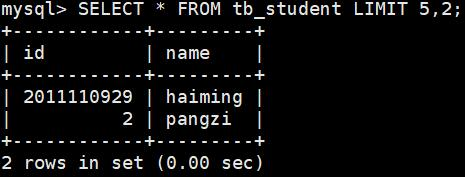

## 一、数据库入门

`> mysql -uroot -p3306 -p20150526?PSW`
与MySQL客户端建立连接，`-u`指定用户名，`-p`指定端口号，`-p`指定密码


`mysql> SHOW DATABASES;`
查看已存在的数据库


`mysql> USE testDB;`
切换数据库


`mysql> CREATE TABLE tb_student(id int,name varchar(10));`
新建表`tb_student`，并指定表的字段、类型


`mysql> SHOW TABLES;`
查询当前数据库下包含的表


`mysql> INSERT tb_student values(2011110924,'dazhao');`
往表`tb_student`添加数据


`mysql> SELECT * FROM tb_student;`
查询表`tb_student`添加的数据


`mysql> DELETE FROM tb_student;`
删除表`tb_student`的数据


## 常用操作：增删改查

`mysql> INSERT INTO tb_student values(2011110924,'dazhao'),(2011110925,'boge'),(2011110926,'bocheng'),(2011110927,'shunyong'),(2011110928,'binge');`
批量添加数据


`mysql> INSERT INTO tb_student(id,name) SELECT id,name FROM tb_student2;`
将另一张表的数据批量添加到当前表`tb_student`


`INSERT INTO tb_student VALUES(2011110924,'zhaolin') ON DUPLICATE KEY UPDATE name='zhaolin';`
按指定字段索引插入数据，如果存在相同索引的记录（冲突），则执行更新操作；更新索引外的其他列数据，该索引为主键


`mysql> DELETE FROM tb_student WHERE name='zhaolin';`
删除符合约束条件的一条或多条记录


`mysql> UPDATE tb_student SET id='2011110929' WHERE name='haiming';`
更新表`tb_student`一条或多条记录


`mysql> SELECT id,name FROM tb_student WHERE id>1 AND id<=5;`
多条件查询表`tb_student`


`mysql> SELECT id FROM tb_student;`
查询表`tb_student`中特定列数据，比如：`id`


`mysql> SELECT * FROM tb_student;`
通配符`*`在查询数据中运用，表示所有的列数据


`mysql> SELECT * FROM tb_student ORDER BY id LIMIT 5;`
对查询的数据执行升序排序（`ASC`），并刷选前5条记录


`mysql> SELECT * FROM tb_student ORDER BY id DESC LIMIT 5;`
对查询的数据执行降序排序（`DESC`），并刷选前5条记录


`mysql> SELECT 2*3,'Hello World', VERSION();`
不带`FROM`关键字的查询语句


`mysql> SELECT * FROM tb_student LIMIT 5,2;`
分页查询数据，使用关键字`LIMIT`




`mysql> SELECT * FROM tb_student ORDER BY RAND() LIMIT 1;`
随机查询一条或多条记录，使用关键字`RAND()`和`LIMIT`


`mysql> SELECT 17,FORMAT(SQRT(36),3);`
格式化查询记录数据，`SQRT`表示开平方根，FORMAT表示带三位小数


`mysql> SELECT CONCAT(name,' 学生学号：',id) FROM tb_student;`
`CONCAT`合并多个查询列记录


`mysql> SELECT CONCAT(name,' 学生学号：',id) as studentInfo FROM tb_student;`
将合并的多个字段用别名代替


## 其他操作MySQL命令

`mysql> DESCRIBE tb_student;`
描述表`tb_student`的结构信息


`mysql> SHOW CREATE TABLE tb_student;`
查看**表**`tb_student`的结构信息


`mysql> SHOW CREATE DATABASE testDB;`
查看**数据库**`testDB`的结构信息


`mysql> SHOW VARIABLES LIKE '%char%';`
模糊查询字符集包含`char`的命令


`mysql> SHOW VARIABLES LIKE '%coll%';`
模糊查询包含`coll`的命令


## 关于字符集编码的命令

`mysql> ALTER TABLE tb_student DEFAULT CHARACTER SET utf8;`
修改表`tb_student`字符集编码：`utf8`


`mysql> ALTER DATABASE testDB DEFAULT CHARACTER SET utf8;`
修改数据库`testDB`字符集编码：`utf8`


`mysql> SET character_set_server=utf8;`
修改MySQL服务器字符集编码：`utf8`


`mysql>SET character_set_client=utf8`
修改MySQL客户端字符集编码：`utf8`


mysql>SET NAMES utf8
设置客户端、服务端的字符集编码：utf8。等同于，同时设置了
```
mysql>SET character_set_client=utf8;
mysql>SET charactter_set_connection=utf8;
mysql>SET character_set_result=utf8;
```


`mysql> ALTER TABLE tb_student MODIFY name VARCHAR(10) CHARACTER SET utf8;`
修改表`tb_student`特定字段字符集编码：`utf8`


``


